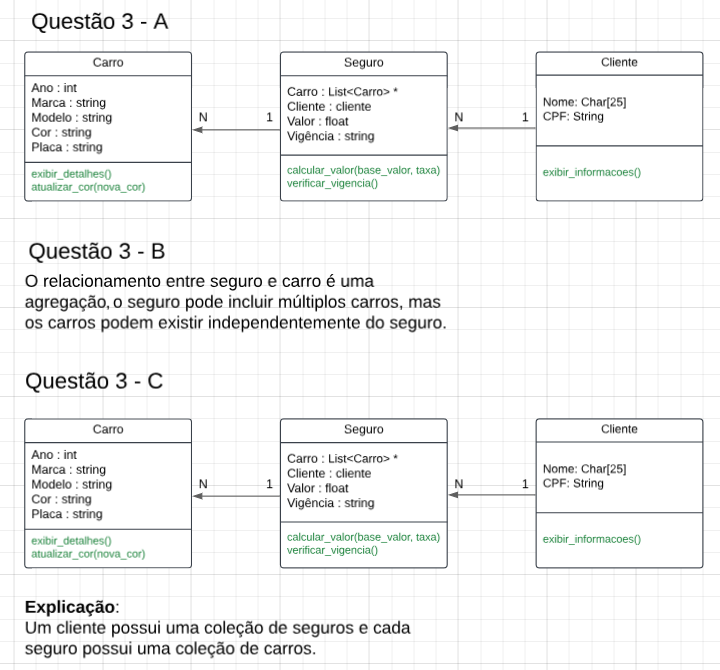
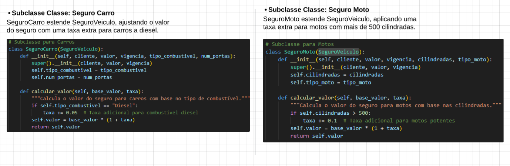
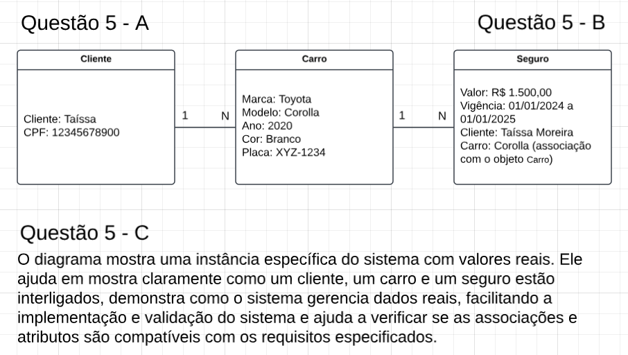
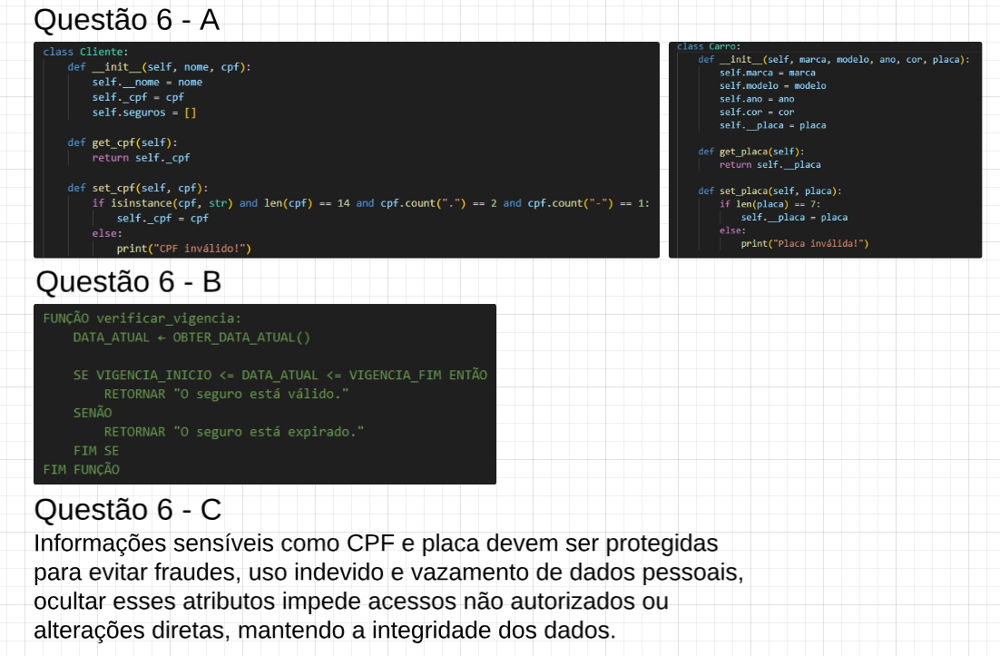

# - Projeto 2 - POO

Este projeto foi desenvolvido para gerenciar seguros de veículos, aplicando conceitos de programação orientada a objetos. O sistema permite criar clientes, veículos e seguros, além de validar informações como CPF e placas. O foco é estruturar dados de forma modular e eficiente, utilizando boas práticas de programação.

# - Funções

- **Classe Carro**:

- get_placa(): Retorna a placa do carro.
- set_placa(): Define a placa do carro com validação de formato.
- atualizar_cor(): Atualiza a cor do carro.
- exibir_detalhes(): Exibe as informações do carro, como marca, modelo, ano, cor e placa.

- **Classe Cliente**:

- get_cpf(): Retorna o CPF do cliente.
- set_cpf(): Define o CPF do cliente com validação de formato.
- adicionar_seguro(): Adiciona um seguro à lista de seguros do cliente.
- exibir_informacoes(): Exibe as informações do cliente, incluindo seguros ativos.

- **Classe Seguro**:

- exibir_informacoes(): Exibe as informações do seguro, como valor e vigência.

# **Exercicio 1:**  
[Exercicio 1](image.png)

# **Exercicio 2:**  
[Exercicio 2](image-1.png)

# **Exercicio 3:**  

# **Exercicio 4:**  

# **Exercicio 5:**  

# **Exercicio 6:**  

