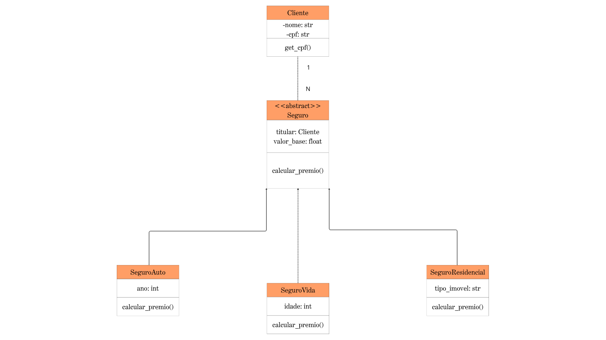

# Projeto 2 — Paradigma de Orientação a Objetos e UML

**InsureTech Pro · Subsistema de Cálculo de Prêmios e Sinistros**

> Projeto avaliativo da disciplina de Engenharia de Software — IFCE  
> Professora: Jéssica de Paulo Rodrigues

---

## Como o Polimorfismo resolveu o código legado

### O problema: código procedural com if/else

O script original centralizava toda a lógica de cálculo em uma única função:

```python
# Antipadrão — viola o princípio Aberto/Fechado
def calcular_valor_seguro(tipo, base, detalhe):
    if tipo == "CARRO":
        ...
    elif tipo == "VIDA":
        ...
    elif tipo == "RESIDENCIAL":
        ...
```

Cada novo tipo de seguro exigia **modificar** essa função, introduzindo risco de regressão e impossibilitando testes isolados.

### A solução: hierarquia de classes + Polimorfismo

A refatoração aplica três pilares da OOP:

**1. Abstração**  
`Seguro` é uma classe abstrata (via `abc.ABC`) que define o contrato `calcular_premio()`. Ela não pode ser instanciada diretamente — existe apenas para garantir que toda subclasse implemente o método.

**2. Herança**  
Cada tipo de seguro é uma subclasse que herda os atributos comuns (`_titular`, `_valor_base`, etc.) e sobrescreve apenas o que é específico:

| Subclasse | Atributo específico | Regra de cálculo |
|---|---|---|
| `SeguroAuto` | `_placa`, `_ano_fabricacao` | `× 1,20` (antes 2010) · `× 1,05` (demais) |
| `SeguroVida` | `_cpf`, `_idade`, `_beneficiario` | `× 2,00` (> 60 anos) · `× 1,10` (demais) |
| `SeguroResidencial` | `_tipo_imovel`, `_area_m2` | `× 1,15` (CASA) · `× 1,05` (APART.) |

**3. Polimorfismo**  
O código cliente (`main.py`) **nunca pergunta o tipo** do seguro. Ele simplesmente chama `.calcular_premio()`:

```python
# Sem nenhum if/else de tipo — o objeto sabe o que fazer
for seguro in lista_de_seguros:
    print(seguro.calcular_premio())
```

O Python despacha automaticamente o método correto para cada objeto em tempo de execução.

**4. Encapsulamento**  
Dados sensíveis (`_cpf`, `_placa`) são privados por convenção (`_`) e expostos apenas via propriedades com mascaramento:

```python
@property
def cpf_mascarado(self) -> str:
    return f"***.{digitos[3:6]}.***-{digitos[9:]}"
```

### Extensibilidade (Princípio Aberto/Fechado)

Para adicionar `SeguroViagem` amanhã, basta:

```python
class SeguroViagem(Seguro):
    def calcular_premio(self) -> float:
        return self._valor_base * 1.30
```

**Nenhum código existente precisa ser alterado.** O `main.py` continua funcionando sem modificações.

---

## Estrutura do projeto

```
Projeto_2/
├── docs/
│   └── diagrama_classes.png    # Diagrama UML exportado
├── src/
│   ├── models/
│   │   ├── __init__.py
│   │   ├── cliente.py          # Entidade Cliente
│   │   └── seguros.py          # Hierarquia: Seguro, SeguroAuto, SeguroVida, SeguroResidencial
│   └── main.py                 # Demonstração do polimorfismo
└── README.md
```

## Como executar

```bash
cd src
python main.py
```

## Saída esperada

```
InsureTech Pro — Sistema de Gestão de Seguros

──── DEMONSTRAÇÃO DE POLIMORFISMO ──────────────────────
  • SeguroAuto             → R$    1800.00
  • SeguroResidencial      → R$     920.00
  • SeguroVida             → R$    4000.00
  ...
  Total geral de prêmios: R$ 10590.00
```

---

## Diagrama de Classes UML



---

*Desenvolvido por: Breno — Projeto_2 InsureTech Pro*
