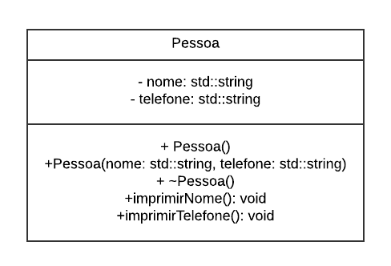

# Projeto Avaliativo 3: Introdução a C++ 🚀

## 📋 Descrição do Projeto
Este projeto tem como objetivo consolidar os conhecimentos sobre a linguagem C++ abordados em aula. Nele, implementamos uma classe `Pessoa` com funcionalidades básicas e manipulamos objetos dessa classe usando o container `std::vector`.

---

## 🔩 Funcionalidades
- **Classe Pessoa**:
  - Atributos: `nome` e `telefone`.
  - Construtores (padrão e parametrizado).
  - Destrutor que exibe mensagens na destruição do objeto.
  - Métodos para impressão de nome e telefone.
  - Uso do ponteiro `this`.
- **Manipulação com `std::vector`**:
  - Armazenamento de objetos da classe `Pessoa`.
  - Iteração para exibir informações de cada pessoa.
- **Modelagem UML**:
  - Diagrama representando a classe `Pessoa`, seus atributos e métodos.

---

## 🔧 Estrutura de Arquivos

```plaintext
Projeto_3/
├── src/                # Código-fonte
│   ├── Pessoa.h        # Declaração da classe Pessoa
│   ├── Pessoa.cpp      # Implementação da classe Pessoa
│   └── main.cpp        # Função principal
├── docs/               # Documentação
│   └── Pessoa_UML.png  # Diagrama UML
└──README.md           # Descrição do projeto
```

---

## ⚙️ Como Executar o Projeto

### Pré-requisitos
- Um compilador C++ (como **GCC**).
- Ambiente de desenvolvimento ou terminal configurado.

### Passos
1. **Clone o repositório**:
   ```bash
   git clone <URL_DO_REPOSITORIO>
   cd Projeto_3
   ```

2. **Compile o código**:
   ```bash
   g++ src/main.cpp src/Pessoa.cpp -o programa
   ```

3. **Execute o programa**:
   ```bash
   ./programa   # Linux/macOS
   programa.exe # Windows
   ```

---

## 🎨 Diagrama UML


---

## 📦 Tecnologias Utilizadas
- Linguagem C++ 🔧
- Container `std::vector`
- Namespace `std`

---