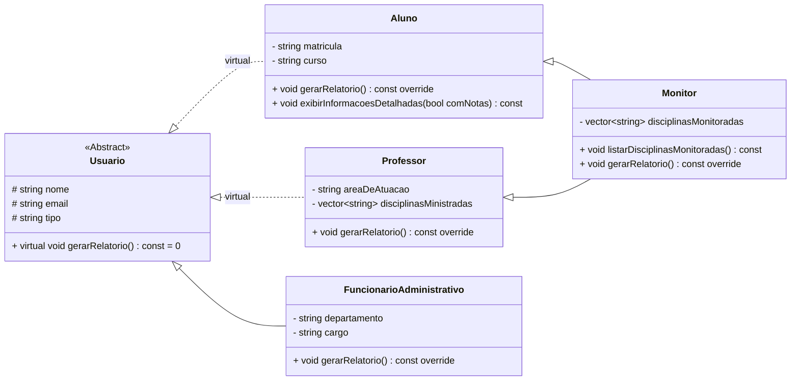

# Projeto Avaliativo 5: Gerenciamento de Sistema Acadêmico

## Descrição do Projeto

Este projeto consiste na implementação de um sistema de gerenciamento para uma instituição acadêmica em C++. [cite_start]O objetivo principal é aplicar e demonstrar conceitos avançados de Programação Orientada a Objetos (POO) para criar um software organizado e escalável[cite: 1, 2].

O sistema expande uma base de gerenciamento de notas para incluir o cadastro de diferentes tipos de usuários e a emissão de relatórios específicos para cada um[cite: 3]. [cite_start]Para isso, foi desenvolvida uma hierarquia de classes que representa Alunos, Professores e Funcionários Administrativos, utilizando polimorfismo para diferenciar a geração de relatórios[cite: 4].

## Conceitos de POO Aplicados

O projeto foi cuidadosamente estruturado para abordar os seguintes pilares da POO:

**Herança**: Uma classe base `Usuario` define atributos e comportamentos comuns que são herdados por classes derivadas como `Aluno`, `Professor` e `FuncionarioAdministrativo`[cite: 5, 19].

**Herança Múltipla**: A classe `Monitor` é criada herdando simultaneamente de `Aluno` e `Professor` para representar um aluno que também possui responsabilidades de ensino[cite: 13].

**Polimorfismo**: Utiliza-se um vetor de ponteiros da classe base (`Usuario*`) para armazenar objetos de diferentes tipos. A chamada ao método `gerarRelatorio()` executa a versão correta da função para cada tipo de objeto, demonstrando o comportamento polimórfico[cite: 15, 19].

**Sobrescrita**: O método `gerarRelatorio()`, declarado como virtual puro na classe `Usuario`, é obrigatoriamente implementado (sobrescrito) em todas as classes derivadas para exibir informações específicas de cada tipo de usuário[cite: 6, 8, 10, 12].

**Sobrecarga**: A classe `Aluno` possui um método sobrecarregado (`exibirInformacoesDetalhadas`) que pode ser chamado de duas formas diferentes: para exibir informações com ou sem as notas do aluno[cite: 16].

## Estrutura de Arquivos

O código do projeto foi modularizado para garantir a organização e a manutenibilidade, conforme os requisitos técnicos[cite: 17]:

```
/
├── Usuario.h
├── Aluno.h
├── Aluno.cpp
├── Professor.h
├── Professor.cpp
├── FuncionarioAdministrativo.h
├── FuncionarioAdministrativo.cpp
├── Monitor.h
├── Monitor.cpp
└── main.cpp
```

## Hierarquia de Classes

`Usuario`: Classe base abstrata com os dados comuns a todos: `nome`, `email` e `tipo`[cite: 5].
`Aluno`: Deriva de `Usuario` e adiciona `matricula` e `curso`[cite: 7].
`Professor`: Deriva de `Usuario` e adiciona `areaDeAtuacao` e uma lista de `disciplinasMinistradas`[cite: 9].
`FuncionarioAdministrativo`: Deriva de `Usuario` e adiciona `departamento` e `cargo`[cite: 11].
`Monitor`: Deriva de `Aluno` e `Professor` (herança múltipla), incluindo um método para listar as disciplinas que monitora[cite: 13, 14].

## Diagrama UML

O diagrama a seguir ilustra as classes do sistema e seus relacionamentos de herança[cite: 21].



## Como Compilar e Executar

1.  **Pré-requisitos**: É necessário ter um compilador C++ instalado (como g++).
2.  **Compilação**: Abra um terminal na pasta raiz do projeto e execute o seguinte comando para compilar todos os arquivos `.cpp` e gerar um executável chamado `sistema_academico`:

    ```sh
    g++ main.cpp Aluno.cpp Professor.cpp FuncionarioAdministrativo.cpp Monitor.cpp -o sistema_academico -std=c++17
    ```

3.  **Execução**: Após a compilação bem-sucedida, execute o programa com o comando:

    ```sh
    ./sistema_academico
    ```

