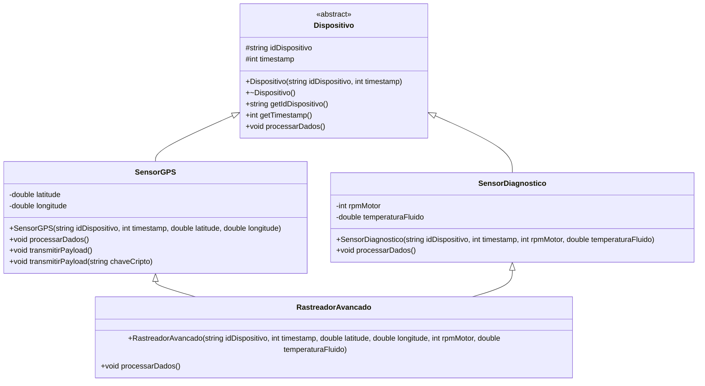

# Projeto Avaliativo 5 - Herança, Polimorfismo, Sobrecarga e Sobrescrita em C++

## Ticket #550: Subsistema de Processamento de Telemetria IoT

## Descrição do Projeto

Este projeto foi desenvolvido como parte do Projeto Avaliativo 5 da disciplina de Programação Orientada a Objetos em C++.

O sistema simula um subsistema de processamento de telemetria IoT utilizado em uma plataforma de gerenciamento de frotas. A aplicação trabalha com diferentes tipos de dispositivos instalados em veículos, como sensores de GPS, sensores de diagnóstico do motor e um rastreador avançado que combina as duas funcionalidades.

O objetivo principal do projeto é aplicar os conceitos de herança, classe abstrata, polimorfismo dinâmico, sobrescrita de métodos, sobrecarga de métodos, herança múltipla, encapsulamento, modularização em arquivos `.h` e `.cpp`, e gerenciamento de memória com ponteiros.

---

## Contexto

A plataforma FleetTrack Pro precisa integrar novos tipos de dispositivos de coleta de dados instalados em veículos. Entre esses dispositivos estão sensores de GPS, sensores de diagnóstico do motor e rastreadores avançados.

O código legado processava os dados de maneira centralizada, dificultando a manutenção e a adição de novos sensores. Para resolver esse problema, o sistema foi refatorado utilizando os princípios da Programação Orientada a Objetos.

A solução criada permite que diferentes dispositivos sejam tratados de forma polimórfica, ou seja, o programa pode chamar o mesmo método `processarDados()` para diferentes tipos de sensores, e cada um executa seu próprio comportamento.

---

## Estrutura de Arquivos

```txt
Projeto_5/
│
├── docs/
│   └── Telemetria_Fleet_UML.png
│
├── src/
│   ├── Dispositivo.h
│   ├── Dispositivo.cpp
│   ├── SensorGPS.h
│   ├── SensorGPS.cpp
│   ├── SensorDiagnostico.h
│   ├── SensorDiagnostico.cpp
│   ├── RastreadorAvancado.h
│   ├── RastreadorAvancado.cpp
│   └── main.cpp
│
└── README.md
```

---

## Tecnologias Utilizadas

- Linguagem: C++
- Paradigma: Programação Orientada a Objetos
- Compilador: g++
- Versionamento: Git e GitHub
- Diagramação: Mermaid UML

---

## Conceitos Aplicados

### Classe Abstrata

A classe `Dispositivo` é uma classe base abstrata. Ela possui atributos comuns a todos os sensores e define o método virtual puro `processarDados()`.

```cpp
virtual void processarDados() = 0;
```

Como esse método é virtual puro, a classe `Dispositivo` não pode ser instanciada diretamente.

---

### Encapsulamento

Os atributos comuns `idDispositivo` e `timestamp` foram definidos como `protected`, permitindo que as classes derivadas acessem esses dados, mas evitando acesso direto externo.

```cpp
protected:
    std::string idDispositivo;
    int timestamp;
```

Nas classes derivadas, os atributos específicos foram definidos como `private`.

---

### Herança Simples

As classes `SensorGPS` e `SensorDiagnostico` herdam da classe base `Dispositivo`.

```cpp
class SensorGPS : public Dispositivo
```

```cpp
class SensorDiagnostico : public Dispositivo
```

---

### Herança Múltipla

A classe `RastreadorAvancado` utiliza herança múltipla, herdando de `SensorGPS` e `SensorDiagnostico`.

```cpp
class RastreadorAvancado : public SensorGPS, public SensorDiagnostico
```

Essa classe representa um dispositivo mais completo, capaz de processar dados de localização e dados de diagnóstico do motor.

---

### Sobrescrita de Métodos

As classes derivadas sobrescrevem o método `processarDados()` da classe base.

```cpp
void processarDados() override;
```

Cada classe implementa sua própria lógica de processamento.

---

### Sobrecarga de Métodos

A classe `SensorGPS` possui sobrecarga do método `transmitirPayload()`.

```cpp
void transmitirPayload();
void transmitirPayload(std::string chaveCripto);
```

A primeira versão transmite os dados em texto puro. A segunda versão simula a transmissão segura utilizando uma chave de criptografia.

---

### Polimorfismo Dinâmico

O polimorfismo é aplicado no arquivo `main.cpp` através de um vetor de ponteiros para a classe base `Dispositivo`.

```cpp
std::vector<Dispositivo*> dispositivos;
```

Esse vetor armazena objetos de classes derivadas, permitindo que o método `processarDados()` seja chamado de forma polimórfica.

```cpp
for (Dispositivo* dispositivo : dispositivos) {
    dispositivo->processarDados();
}
```

---

### Gerenciamento de Memória

Como os objetos são criados dinamicamente com `new`, eles são liberados ao final da execução com `delete`.

```cpp
for (Dispositivo* dispositivo : dispositivos) {
    delete dispositivo;
}
```

A classe base possui destrutor virtual para garantir que os objetos derivados sejam destruídos corretamente.

```cpp
virtual ~Dispositivo();
```

---

## Descrição das Classes

### Dispositivo

Classe base abstrata do sistema.

Responsabilidades:

- Armazenar o identificador do dispositivo.
- Armazenar o timestamp da coleta.
- Definir o contrato do método `processarDados()`.

Atributos:

```cpp
std::string idDispositivo;
int timestamp;
```

Método principal:

```cpp
virtual void processarDados() = 0;
```

---

### SensorGPS

Classe responsável por representar um sensor de localização GPS.

Herda de:

```cpp
Dispositivo
```

Atributos:

```cpp
double latitude;
double longitude;
```

Responsabilidades:

- Processar dados de localização.
- Exibir latitude e longitude.
- Demonstrar sobrecarga de métodos com `transmitirPayload()`.

Métodos principais:

```cpp
void processarDados() override;
void transmitirPayload();
void transmitirPayload(std::string chaveCripto);
```

---

### SensorDiagnostico

Classe responsável por representar um sensor de diagnóstico do motor.

Herda de:

```cpp
Dispositivo
```

Atributos:

```cpp
int rpmMotor;
double temperaturaFluido;
```

Responsabilidades:

- Processar dados do motor.
- Exibir RPM.
- Exibir temperatura do fluido.
- Informar se a temperatura está normal ou elevada.

Método principal:

```cpp
void processarDados() override;
```

---

### RastreadorAvancado

Classe responsável por representar um dispositivo avançado que combina GPS e diagnóstico do motor.

Herda de:

```cpp
SensorGPS
SensorDiagnostico
```

Responsabilidades:

- Demonstrar herança múltipla.
- Processar dados combinados de localização e diagnóstico.
- Reutilizar os métodos das classes pai.

Método principal:

```cpp
void processarDados() override;
```

---

## Como Compilar

Para compilar o projeto, abra o terminal dentro da pasta `Projeto_5` e execute:

```bash
g++ src/*.cpp -o telemetria
```

No Windows, também pode gerar diretamente o `.exe`:

```bash
g++ src/*.cpp -o telemetria.exe
```

---

## Como Executar

No Windows:

```bash
telemetria.exe
```

ou:

```bash
.\telemetria.exe
```

No Linux ou Mac:

```bash
./telemetria
```

---

## Saída Esperada

Ao executar o programa, a saída será parecida com esta:

```txt
=== Teste de Sobrecarga de Metodos ===
Transmitindo dados GPS em texto puro...
Transmitindo dados GPS com criptografia.
Chave utilizada: CHAVE-SEGURA-123

=== Processamento Polimorfico ===

-----------------------------
Sensor GPS [GPS-001]
Timestamp: 1001
Localizacao: Latitude -5.0845, Longitude -39.3703

-----------------------------
Sensor Diagnostico [DIAG-001]
Timestamp: 1002
RPM do motor: 2500
Temperatura do fluido: 92.5 C
Status do motor: normal.

=== Heranca Multipla ===
Rastreador Avancado processando dados combinados...
Sensor GPS [RAST-001]
Timestamp: 1004
Localizacao: Latitude -5.2, Longitude -39.5
-----------------------------
Sensor Diagnostico [RAST-001]
Timestamp: 1004
RPM do motor: 3100
Temperatura do fluido: 105.8 C
Alerta: temperatura elevada no motor!
```

---

## Diagrama UML

O diagrama UML do projeto está localizado na pasta:

```txt
docs/Telemetria_Fleet_UML.png
```

Representação UML em Mermaid:



---

## Fluxo de Execução

1. O programa inicia no arquivo `main.cpp`.
2. É criado um vetor de ponteiros da classe base `Dispositivo`.
3. São adicionados objetos das classes `SensorGPS` e `SensorDiagnostico`.
4. O programa testa a sobrecarga do método `transmitirPayload()`.
5. O programa percorre o vetor e chama `processarDados()` de forma polimórfica.
6. Cada objeto executa sua própria versão do método.
7. É criado um objeto `RastreadorAvancado`.
8. O rastreador processa dados combinados de GPS e diagnóstico.
9. Os objetos criados dinamicamente são liberados da memória com `delete`.
10. O programa encerra.

---


## Critérios Atendidos

| Critério | Status |
|---|---|
| Classe base abstrata `Dispositivo` | Atendido |
| Atributos comuns protegidos | Atendido |
| Método virtual puro `processarDados()` | Atendido |
| Classe `SensorGPS` com herança simples | Atendido |
| Classe `SensorDiagnostico` com herança simples | Atendido |
| Classe `RastreadorAvancado` com herança múltipla | Atendido |
| Sobrescrita de métodos com `override` | Atendido |
| Sobrecarga de métodos em `SensorGPS` | Atendido |
| Polimorfismo com `std::vector<Dispositivo*>` | Atendido |
| Uso de ponteiros | Atendido |
| Liberação de memória com `delete` | Atendido |
| Destrutor virtual | Atendido |
| Separação em arquivos `.h` e `.cpp` | Atendido |
| Diagrama UML | Atendido |
| Documentação no README | Atendido |

---

## Autor

Projeto desenvolvido por:

**Ivamilton Ferreira da Silva Junior**

---

## Observações Finais

Este projeto demonstra a aplicação prática dos principais conceitos de Programação Orientada a Objetos em C++, com foco em herança, polimorfismo, sobrescrita, sobrecarga e herança múltipla.

A arquitetura foi organizada para facilitar manutenção, extensão e entendimento do sistema.