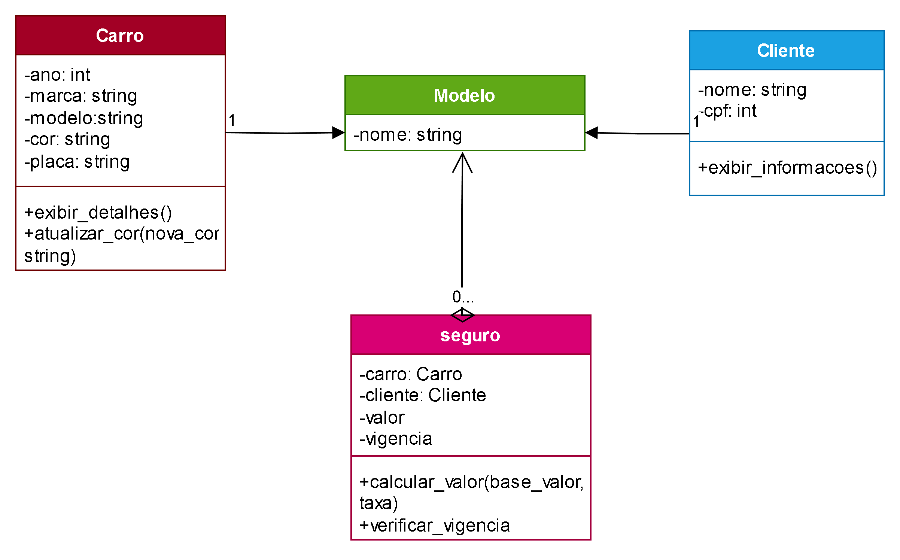

# Projeto Avaliativo 2 – Paradigma de Orientação a Objetos e UML

## Descrição Geral
Este projeto consiste na modelagem e implementação de um sistema de seguros para carros, utilizando o paradigma da Programação Orientada a Objetos (POO). Foram desenvolvidas classes em Python com base em um cenário proposto, bem como um diagrama UML para representar visualmente as estruturas do sistema. A proposta inclui criação de atributos, métodos, definição de relacionamentos entre as classes e testes automatizados.

---

## Exercício 1 – Modelagem de Domínio

### a) Diagrama de Classes UML  
O diagrama de classes abaixo representa as três principais entidades do sistema: Carro, Cliente e Seguro. Cada classe possui seus respectivos atributos e os relacionamentos foram definidos com base na lógica do domínio.



### b) Relações entre as Classes  
- **Seguro - Carro:**  
  Relação de agregação. Um seguro depende de um carro para existir, mas o carro pode existir independentemente de estar segurado. O seguro apenas faz referência a um carro existente.

- **Seguro - Cliente:**  
  Também se trata de uma relação de agregação. Um seguro está vinculado a um cliente, mas o cliente pode existir no sistema mesmo sem possuir um seguro.

### c) Justificativa dos Relacionamentos  
A escolha por agregação nos dois relacionamentos se justifica pelo fato de que as classes Carro e Cliente não dependem da existência da classe Seguro para serem criadas ou utilizadas. Elas representam entidades independentes que podem ser referenciadas por diferentes instâncias de seguro. Além disso, um mesmo cliente pode contratar vários seguros para diferentes carros, reforçando a natureza da agregação.

---

## Exercício 2 – Detalhamento de Atributos e Métodos

### Classe Carro  
**Atributos:**  
- ano  
- marca  
- modelo  
- cor  
- placa  

**Métodos:**  
- `exibir_detalhes()`: exibe as informações principais do carro.  
- `atualizar_cor(nova_cor)`: altera a cor do carro.

### Classe Cliente  
**Atributos:**  
- nome  
- cpf  

**Método:**  
- `exibir_informacoes()`: exibe o nome e o CPF do cliente.

### Classe Seguro  
**Atributos:**  
- carro  
- cliente  
- valor  
- vigencia  

**Métodos:**  
- `calcular_valor(base_valor, taxa)`: calcula o valor final do seguro a partir de um valor base e uma taxa.  
- `verificar_vigencia()`: verifica se a data atual está dentro da vigência do seguro, retornando True ou False.

---

## Estrutura dos Arquivos

- **carro.py:** define a classe Carro com seus atributos e métodos.  
- **cliente.py:** define a classe Cliente com seus atributos e método.  
- **seguro.py:** define a classe Seguro, seus atributos e operações.  
- **test_carro.py:** arquivo de testes com funções para validar os métodos da classe Carro.

---

## Testes Automatizados

Foi criado um arquivo de teste `test_carro.py` com exemplos de funções para garantir o funcionamento correto dos métodos implementados.

**Exemplo de teste para `exibir_detalhes()`:**

```python
def test_exibir_detalhes():
    carro = Carro(2020, "Toyota", "Corolla", "Prata", "ABC1234")
    assert carro.exibir_detalhes() == "2020 Toyota Corolla - Cor: Prata, Placa: ABC1234"
